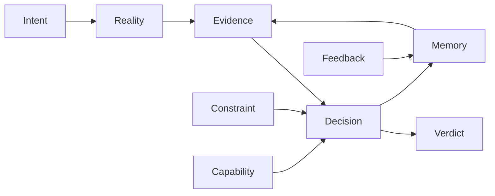

# 001 Decision Ontology

## Purpose

Define the canonical vocabulary all BLACK modules use when exchanging decision data. The ontology is a contract layer, not an intelligence implementation.

## Core Concepts

| Concept | Definition | Purpose | Producer | Consumer |
| --- | --- | --- | --- | --- |
| Intent | A declared objective or desired state that initiates a decision cycle. | Preserve why a decision exists before actions are considered. | Goal generation, users, task intelligence | Reasoner, kernel, governance |
| Decision | A selected or rejected course of action under stated evidence, reality, constraints, confidence, and risk. | Make choices auditable and transportable. | Kernel | Execution, memory, governance |
| Reality | The bounded representation of current operating conditions relevant to an intent. | Anchor decisions to observed context. | World model, explorer, event bus | Reasoner, kernel, governance |
| Truth | A claim state accepted within a declared validation boundary and provenance chain. | Separate validated claims from raw observations or predictions. | Governance, evidence validation | Reasoner, kernel, memory |
| Evidence | A sourced item that supports, weakens, or contextualizes a claim or candidate action. | Give every decision an inspectable basis. | Explorer, world model, memory, governance | Reasoner, kernel, decision packet |
| Constraint | A boundary limiting acceptable actions, resources, timing, policy, or risk. | Prevent decisions from violating known limits. | Governance, runtime, user, environment | Reasoner, kernel, execution |
| Capability | A named ability a subsystem or tool can provide with metadata and constraints. | Allow planning without direct subsystem coupling. | Capability registry, modules | Kernel, reasoner, service locator |
| Confidence | A normalized degree of support for evidence, predictions, or decisions. | Expose uncertainty explicitly. | Evidence validation, reasoner, world model | Kernel, governance, memory |
| Risk | A typed estimate of downside exposure associated with an action or decision. | Make unsafe or costly choices visible before execution. | Governance, reasoner, world model | Kernel, execution, memory |
| Debt | A deferred cost, unresolved uncertainty, or compromise created by a decision. | Track long-term obligations. | Kernel, governance, memory | Goal generation, reasoner, governance |
| Verdict | The governance-compatible decision state such as approved, rejected, deferred, or needs evidence. | Provide a canonical handoff state. | Kernel, governance | Execution, memory, runtime |
| Observation | A recorded signal from the environment or a subsystem at a known time. | Feed reality construction and evidence generation. | Event bus, world model, explorer | Evidence, memory, reasoner |
| Prediction | A stated expectation about a future state with confidence and provenance. | Make foresight inspectable without treating it as fact. | World model, reasoner | Simulation, kernel, governance |
| Simulation | A bounded projection of possible outcomes for candidate actions. | Represent consequence estimates without executing actions. | World model, reasoner | Kernel, governance, memory |
| Feedback | A post-decision signal describing observed execution results or external response. | Close the decision loop. | Execution, event bus, users | Memory, goal generation, governance |
| Memory | Durable retained information about observations, evidence, decisions, feedback, and compressed history. | Provide continuity across cycles. | Memory subsystem | Explorer, reasoner, kernel, governance |
| Compression | A controlled transformation that reduces stored information while preserving declared decision value. | Keep memory usable at scale. | Memory, compression subsystem | Reasoner, governance, explorer |

