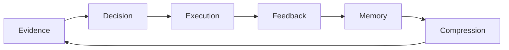

# 002 Decision Loop

## Purpose

Define the canonical loop for decision improvement.

```mermaid
flowchart LR
    Evidence --> Decision
    Decision --> Execution
    Execution --> Feedback
    Feedback --> Memory
    Memory --> Compression
    Compression --> Evidence
```

## Rule

The loop must serve truth and reality, not architecture for its own sake.
