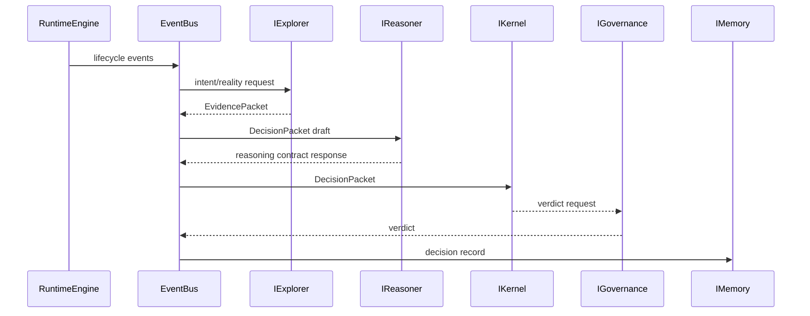

# 002 Decision Loop

BLACK v1 Phase 2 defines the data contracts for the decision loop without implementing algorithms.

All subsystem communication remains EventBus mediated. Interfaces expose lifecycle methods compatible with RuntimeEngine: `initialize`, `register`, `health`, and `shutdown`.
