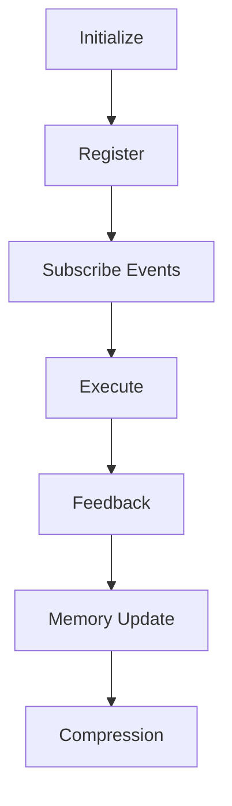

# BLACK Enterprise Intelligence OS

BLACK is a **Decision Operating System**. Every component exists only to improve decision quality.

## Design Philosophy

> Architecture serves decisions.
> Decisions serve truth.
> Truth serves reality.
> Nothing serves architecture.

BLACK is the center. Runtime, Kernel, Reasoner, World Model, Explorer, Memory, Governance, Execution, Feedback, Compression, and Plugins are components that serve BLACK.

## Existing Runtime Constraint

RuntimeEngine and EventBus already exist in the repository. They must not be rewritten, replaced, or bypassed. BLACK v1.0 modules are architecture bootstrap placeholders that future implementation must register through the existing RuntimeEngine lifecycle and communicate through namespaced EventBus events.

## Lifecycle



## Repository Layout

```text
BLACK/
├── README.md
├── LICENSE
├── .gitignore
├── requirements.txt
├── pyproject.toml
├── docs/
├── CANON/
├── CONSTITUTION/
├── SPECS/
├── runtime/
├── kernel/
├── reasoner/
├── world_model/
├── explorer/
├── memory/
├── governance/
├── execution/
├── feedback/
├── compression/
├── plugins/
├── tests/
├── scripts/
├── configs/
└── examples/
```

## Bootstrap Scope

This repository state creates the BLACK v1.0 architecture skeleton only. It does not implement algorithms, business logic, or new runtime behavior.

## Local Usage

The existing BLACK ORIGIN runtime still targets a Windows local environment:

1. Double-click `install.bat`.
2. Double-click `run.bat`.
3. Use `startup.bat` to install and run in one step.
