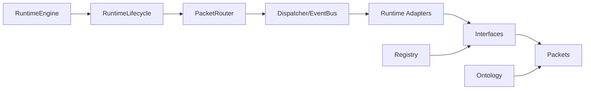
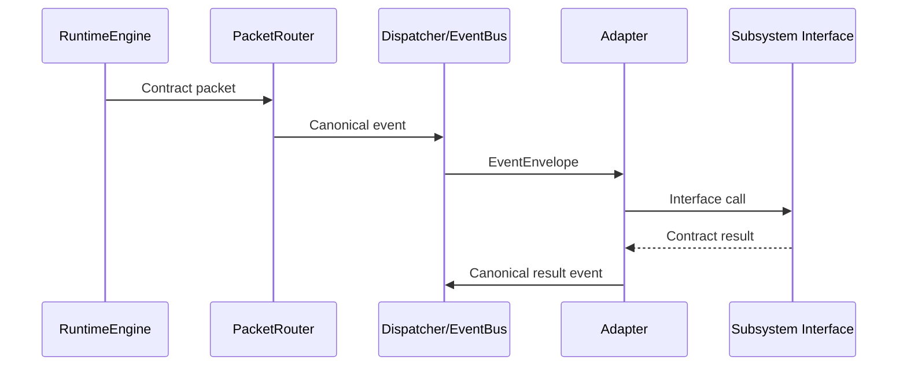

# BLACK Core Specification

BLACK Core is organized around runtime-compatible contracts:

- Ontology: canonical language for decisions.
- Interfaces: abstract subsystem boundaries.
- Packets: immutable data exchanged through EventBus.
- Registry: capability and dependency metadata registration.
- Runtime integration: lifecycle, dispatcher, packet router, canonical events, and adapters.

## Phase 3 Packet Flow

Phase 3 establishes runtime connectivity only. Intelligence, search, reinforcement learning, MCTS, OpenMythos, decision-kernel logic, and world simulation remain outside this phase.
