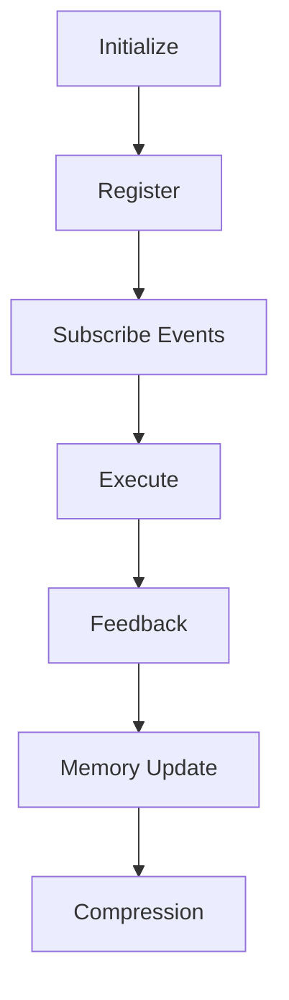

# BLACK Core Specification

## Identity

BLACK is a Decision Operating System. Every component exists only to improve decision quality.

## Supreme Principle

Architecture serves decisions. Decisions serve truth. Truth serves reality. Nothing serves architecture.

## Existing Runtime Rule

RuntimeEngine and EventBus already exist. They must not be rewritten, replaced, or bypassed. New BLACK v1.0 modules register through the existing runtime lifecycle and communicate through namespaced EventBus events.

## Required Pre-Implementation Review

Before implementation, review:

1. BLACK Core Specification;
2. Constitution L0-L5;
3. the relevant component specification;
4. the relevant Canon document;
5. related issue, PR, commit, and design logs;
6. compatibility with the current RuntimeEngine and EventBus.

If existing design conflicts with a proposed implementation, existing design wins until an approved design change supersedes it.

## Runtime Lifecycle

## Required Module Interface

Every module exposes:

| Method | Purpose |
| --- | --- |
| `initialize()` | Prepare runtime-owned dependencies |
| `register()` | Register with RuntimeEngine and EventBus |
| `health()` | Report lifecycle health |
| `version()` | Report contract version |
| `shutdown()` | Release runtime-owned resources |
