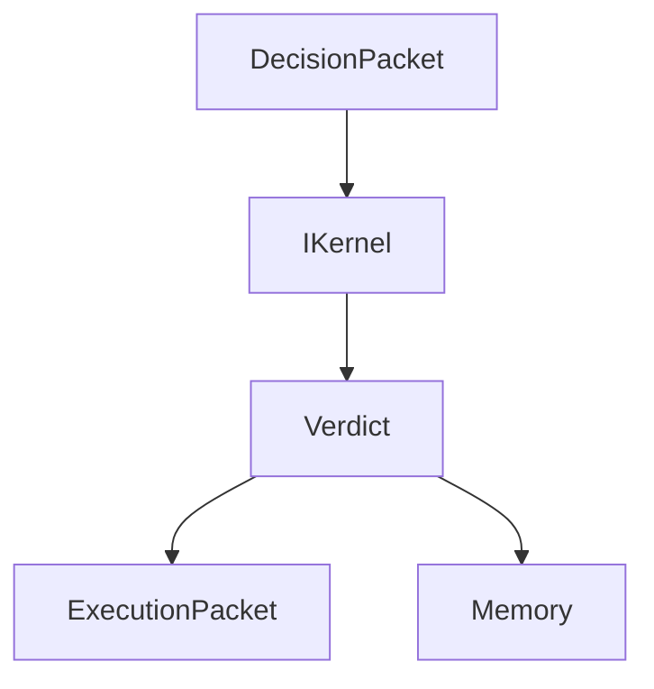

# Kernel Specification

The kernel consumes `DecisionPacket` contracts and emits governance-compatible verdict state. Phase 2 adds the `IKernel` abstract interface and immutable packet contracts only; it does not implement decision algorithms.

The kernel must register through RuntimeEngine and communicate through EventBus. Direct subsystem coupling is prohibited.
