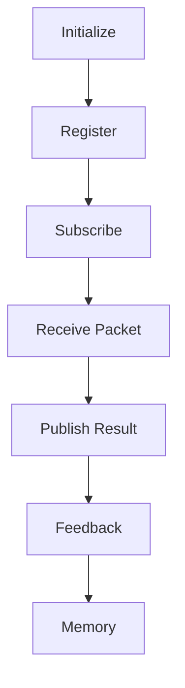
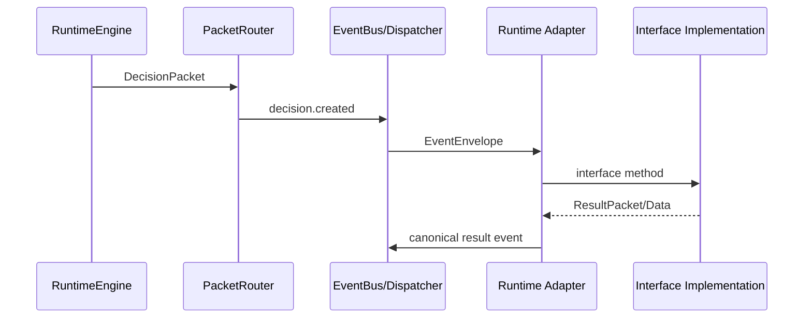

# BLACK v1.0 Architecture

## Purpose

BLACK is a Decision Operating System. Every component exists to improve decision quality without replacing the existing RuntimeEngine or EventBus.

## Runtime Lifecycle

Phase 3 connects Phase 2 contracts to runtime execution while avoiding decision intelligence, search, reasoning algorithms, and world simulation.

## Packet Flow

The RuntimeEngine does not inspect business logic. `PacketRouter` maps known immutable packet contracts to canonical event names, then dispatches through the event bus boundary.

## Integration Rule

Modules expose lifecycle interfaces and communicate through namespaced events. Subsystems remain independently replaceable; Explorer, Reasoner, World Model, Memory, and Kernel do not directly import each other.

## Decision Table

| Concern | Rule |
| --- | --- |
| Runtime | Extend existing RuntimeEngine lifecycle only |
| Events | Use canonical EventType names and EventEnvelope payloads |
| Packets | Route immutable contracts only |
| Plugins | Capabilities are loadable through the plugin interface |
| Memory | Decision traces must be replayable |
| Governance | Constitution and evidence rules gate changes |
