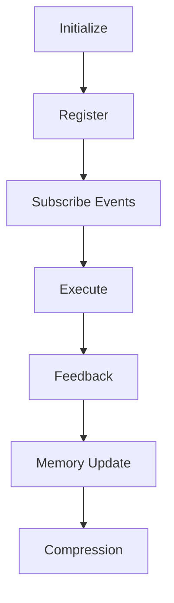

# BLACK v1.0 Architecture

## Purpose

BLACK is a Decision Operating System. Every component exists to improve decision quality without replacing the existing RuntimeEngine or EventBus.

## Runtime Lifecycle

## Integration Rule

Modules expose lifecycle interfaces and communicate through namespaced events. Direct cross-module calls are reserved for dependency-injected interfaces owned by the runtime.

## Decision Table

| Concern | Rule |
| --- | --- |
| Runtime | Extend existing RuntimeEngine lifecycle only |
| Events | Use namespaced EventBus messages |
| Plugins | Capabilities are loadable through the plugin interface |
| Memory | Decision traces must be replayable |
| Governance | Constitution and evidence rules gate changes |
