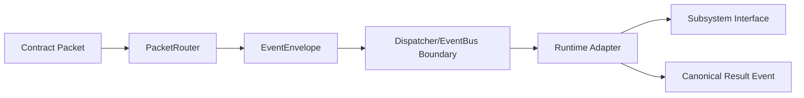

# Design Review

## BLACK v1.0 Phase 3 Runtime Integration Review

Phase 3 adds runtime connectivity for the Phase 2 contracts. It intentionally avoids search, reasoning, world simulation, OpenMythos, decision-kernel logic, and any direct subsystem coupling.

## Sources Reviewed

- `runtime/lifecycle.py`
- `runtime/dispatcher.py`
- `runtime/packet_router.py`
- `events/event_types.py`
- `events/subscriptions.py`
- `events/publishers.py`
- `adapters/explorer_adapter.py`, `adapters/reasoner_adapter.py`, `adapters/kernel_adapter.py`, `adapters/memory_adapter.py`
- `contracts/decision_packet.py`, `contracts/evidence_packet.py`, `contracts/execution_packet.py`
- `SPECS/BLACK_Core.md`
- `CANON/001_Decision_Ontology.md`, `CANON/002_Decision_Loop.md`

## Runtime Connectivity

## Review Conclusion

The Phase 3 layer preserves the existing runtime architecture by adding replaceable lifecycle, dispatch, route, publish, subscribe, and adapter modules. The dispatcher and router are contract-aware but not domain-intelligent. Adapters translate events into interface calls and publish canonical events back through the bus boundary.
